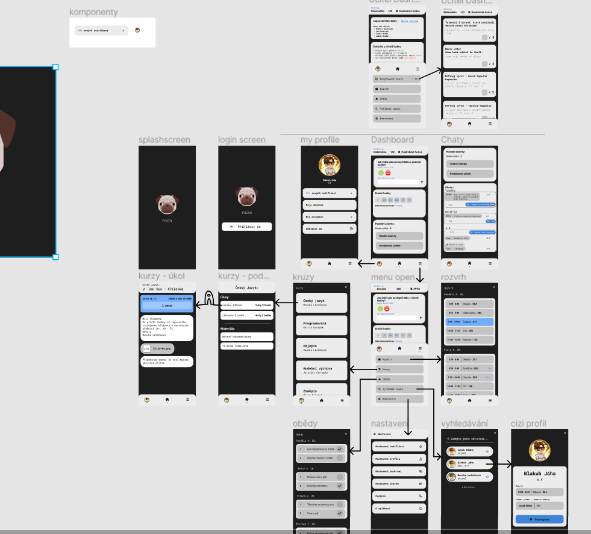

# ŠKOLNÍ SYSTÉM - PUGIN

-   Náš projekt je postaven na základně univerzálního modulárního školního systému, který
    je jednoduchý na používání a zaměřený na všestrannost a obousměrnou komunikaci ve
    školství.
-   Projekt nejdříve popisujeme z hlediska funkční stránky, která je tradičnímu uživateli
    skrytá. Co se týče této části systému, je pro nás hlavní **modulárnost** , abychom mohli co
    nejlépe a nejjednodušeji vyhovět požadavkům co největší škále škol.
-   V druhé části se zaměříme na UI (User Interface - _uživatelské rozhraní_ ) a UX (User
    Experience - _design interakce_ ) a způsoby, jak co nejvícezjednodušit a zpříjemnit práci s
    naším systémem.

## Motivace

Problémem současného školství je velká neefektivita a chaos, co se týče organizačních
věcí. Řada škol se pokusila přejít na moderní digitální systémy, ovšem tento přechod byl
většinou jen částečný a nepodařený, čímž vznikl ještě větší chaos. Sami dobře víme, jak
matoucí například je, když někteří učitelé používají elektronické třídní knihy a někteří si
píšou docházku na vlastní kus papíru. Většina těchto problémů plyne ze složitých
systému, které mají někteří problém pochopit a které jsou svým specifickým využitím a
způsobem ovládání náročné na použití. Všechny tyto problémy chceme vyřešit naším
systémem, který je modulární - tudíž nabízí mnoho funkce, ale není nutné tyto funkce
využívat (tento fakt nám dovoluje ucelit způsob ovládání napříč všech možných
potřebných funkcí) - a silně personalizovaný - díky tomuto je systém rychlý, přehledný a
efektivní. Naše hlavní myšlenka je tato: Čím jednoduššía používanější systém je, tím více
času, který je nyní ztracený složitou zdlouhavou administrativou a organizací, ušetří a tím
víc je škola jako celek efektivnější.

## Modulárnost

-   Náš systém nabídne širokou škálu personalizace a to jak na úrovni celoškolní, tak na úrovni
    jednotlivých uživatelů.
-   **celoškolní personalizace:**
    -   Celý systém používá pluginy, které odpovídají celistvým a oddělitelným systémům
        ve škole samotné.
    -   Hlavním a základním stavebním blokem je tedy systém uživatelů (učitelů, studentů
        a ostatního personálu), který obsahuje účty skrze které se budou uživatelé do
        systému přihlašovat. Každý účet bude mít svou roli, která odpovídá jeho oprávněním
        v systému (např.: Učitelé mohou vytvářet kurzy pro žáky, zadávat jim test, ..., ale žáci
        učitelům nikoliv).
    -   Příkladem může být systém na objednávání obědů, který použije účty studentů a
        personálu a přidá jim možnost směnit peníze za obědové tokeny, které následně
        mohou použít na objednání obědů.
        

​ _zde na obrázku je graficky znázorněna stavba našeho systému z bloků (pluginů)_

-   **uživatelská personalizace:**
    -   Míra, frekvence i obsah notifikací je přesný příklad oblasti, kterou si každý šije sám
        pro sebe, tudíž si uživatel sám může upravit nastavení.
    -   Systém také používá počítačové učení k vyhodnocování užitečného obsahu, který
        uživateli ukazuje tvz. "feedu". Tento "feed" jde samozřejmě obejít klasickou
        statickou strukturou uživatelského rozhraní, ovšem "feed" je dynamický a
        personalizovaný, tudíž kdy učiteli začne hodina, tak mu nabídne třeba odkaz na
        zápis do třídnice, nebo když studentovi skončí hodina, ukáže mu jaký předmět
        následuje a v jaké učebně.

### Pluginy

-   **Rozvrh** - Systém sám vytvoří rozvrh, nebo může být rozvrh nahrán či zadán. Všechny
    informace se budou následně ukazovat studentům. Rozvrh daných lidí se bude
    ukazovat i na jejich profilové stránce.
-   **Absence** - Učitel na začátku hodiny zapisuje absenci. Rozšířená možnost je automatické
    předvyplňování, které bude fungovat pomocí sledování přihlášených účtů na síti.
    Učitel následně zkontroluje případně opraví absenci. - Absence se ukládá a student ji může zobrazit a fyzicky učiteli omluvit. Učitel ji
    pak omluví i v systému, kde absence zmizí.

-   **Webová stránka**

    -   Pro širokou veřejnost tento plugin vytvoří webovou stránku, která obsahuje
        všechny důležité obecné i aktuální informace o škole a studiu.

-   **Komunikace**

    -   Meety (či videokonference) umožní provádět výuku v distanční formě. Meety jsou
        buď společné s kurzy, nebo samostatné. Meety je možné plánovat a to i
        pravidelně.
    -   Chat je nejrychlejší způsob komunikace mezi učiteli a studenty, ideální prostředek
        pro krátké dotazy či připomínky. Příkladem využití může být situace, kdy učitel se
        potřebuje setkat s žákem (či naopak) osobně, ale je složité zjistit, kde ve škole se
        zrovna nachází - toto jde vyřešit krátkou zprávou v chatu.
    -   Po každé hodině, jak učitelům, tak studentům, přijde notifikace ohledně
        feedbacku z hodiny. Studenti budou mít možnost si vybrat jednu možnost z dané
        kategorie: - Zábavná hodina – Nudná hodina

        -   Pochopil jsem látku – Nepochopil jsem látku (případně komentář, co jsem
            nepochopil)

        -   Tempo učitele: Rychlé – Akorát – Pomalé

        -   Těžké příklady – Jednoduché příklady

-   **Kurzy**

    -   Každý kurz odpovídá jednomu předmětu pro danou třídu - toto ovšem není
        pravidlem, kurz může být učitelem vytvořen například i pro školní kroužek. Kurzy
        mohou vytvářet jen učitelé.

    -   Každý kurz má řadu možností, které lze jednotlivě aktivovat:

        -   materiály = přidávání učebních materiálů

        -   úkoly = zadávání domácích úkolů, které pak student odevzdá a učitel
            ohodnotí zpětnou vazbou

        -   testy = časově omezený úkol, který je ohodnocen zpětnou vazbou a výsledkem

        -   známkování = kurz bude zaznamenávat výsledky a jejich průměr a
            zobrazovat jednotlivým studentům

    -   Kurzy jsou zaměřené na obousměrnou komunikaci, tudíž disponují hromadnými
        komentáři, soukromými komentáři a rychlými reakcemi (úkol byl
        těžký/jednoduchý, materiál chápu/nechápu a klasické 👍👎)

    -   Kurzy jsou plné statistik a analytiky a to od sledování kdo, jak dlouho a kdy
        zobrazil materiál až po průměrné výsledky testů - vše, co může pomoci učiteli
        zjistit, jakou látku musí více probrat a jak upravit výuku tak, aby byla co
        nejefektivnější.

-   **Obědy**

    -   Systém na objednávání obědů, který umožní studentům zakoupit si pro svůj účet
        obědové tokeny, které potom může použít na objednání obědu. Pokud si svůj
        výběr rozmyslí až v době, kdy už nelze svou volbu změnit, může dát svůj oběd do
        burzy, odkud si ho může jiný uživatel od něj zakoupit.

-   **Cloud drive**

    -   Sdílené úložiště, které slouží ke sdílení souborů. Úložiště je rozděleno do vrstev -
        celoškolní, třídní, kurzová, jednotlivá. Tyto vrstvy se liší tím, kdo jaká skupina lidí k
        nim má přístup. Žák má upravovací práva pouze na svou vlastní složku v
        jednotlivé vrstvě. Učitelé mají upravovací práva na všech vrstvách.

-   **Rodiče**

    -   Plugin, který ke každému účtu studenta vytvoří rodičovský účet. Tento účet bude
        mít přístup k výsledkům a statistikám daného studenta a zároveň bude mít
        přístup k případným kurzům či meetům pro rodiče ( _např.:rodičovské schůzky_ ).

-   **...**

    -   Systém je připravený na integraci third party pluginů. Tyto pluginy může napsat
        kdokoliv a mohou sloužit k mnohým automacím a spojením s jinými systémy.
        Příkladem může být použití služby Zoom pro meety nebo například automatické
        upozornění rodiče e-mailem, když žákova absence přesáhne určitou mezi.

## Uživatelské rozhraní

-   Dnešní doba je doba mobilních telefonu, proto je aplikace pro interakci designovaná hlavně
    pro telefony. I v desktopovém prohlížeči se proto ukáže stejné rozhraní, jako na mobilním
    telefonu. Díky tomuto je velice snadné přecházet ze zařízení na zařízení.
-   Hlavní složkou uživatelského rozhraní je zde “dashboard.” Tento dashboard je první
    stránkou, kterou uživatel vidí, když aplikaci otevře. Dashboard je unikátní tím, že se jeho
    obsah dynamicky mění v závislosti na čase, dni a mnohých dalších faktorech, které
    algoritmus strojového učení vezme a vyhodnotí nejdůležitější odkazy, informace a cesty v
    aplikaci a následně je ukáže jakožto jednotlivé interaktivní bloky na dashboardu.
-   Zbytek uživatelského rozhraní je navržen staticky a přehledně tak, aby kdokoliv, kdo ho chce
    používat, věděl co hned má dělat. Tímto cílíme hlavně na starší učitele a mladé studenty,
    kteří se obecně v technologiích moc neorientují.
-   Chceme, aby bylo uživatelské rozhraní vhodné pro co největší škálu lidí - toho dosahujeme
    jednoduchou škálou barev. Aplikace je tak vhodná i pro lidi s problémy se zrakem,
    barvoslepostí i jinými zrakovými dispozicemi. Všechen text je vysoce kontrastní, používáme
    dobře čitelný font. Kvůli slepým lidem jsme obsah (jako obrázky) vybavili alternativním
    přepisem, který jim jejich asistenti pro používání mobilního telefonu mohou přečíst.
-   Základní design aplikace k našemu systému jsme vytvářeli v programu Figma, tudíž jsou
    naše designy přístupné přes internetZDE
    

    _zde na obrázku je pohled na proces designování uživatelského rozhraní v programu Figma_

## Závěr

Školní systémy jsou velice komplexní záležitost, kterou je nesmírně složité udělat
dokonalou. My, jakožto studenti, a naši učitelé jsme se shodli, že to potřebuje změnu, tak
jsme se rozhodli ji začít. Jsme si vědomi toho, že vždy je co zdokonalovat, proto máme v
plánu přijímat tolik zpětné vazby od uživatelů, kolik jen půjde a postupně ještě více
zlepšovat náš systém. Chceme, aby náš systém pomohl zefektivnit školní výuku a aby
zjednodušil práci jak studentům, tak učitelům, ale i všem ostatním lidem, kteří se nějakým
způsobem zapojují do systému školství. Pevně věříme a doufáme, že se naše vize naplní.

## Důležité odkazy

-   Deploy prototypu aplikace k našemu systému:

    [https://pugin-jakubblaha-ids.vercel.app/home](https://pugin-jakubblaha-ids.vercel.app/home)

-   GitHub s prototypem aplikace k našemu systému:

    [https://github.com/jakubblaha-ids/pugin](https://github.com/jakubblaha-ids/pugin)

-   Figma s designem aplikace k našemu systému:

    [https://www.figma.com/file/79mT7Vch4mUpTVZuLfopYq/heketon?node-id=19%3A](https://www.figma.com/file/79mT7Vch4mUpTVZuLfopYq/heketon?node-id=19%3A)
